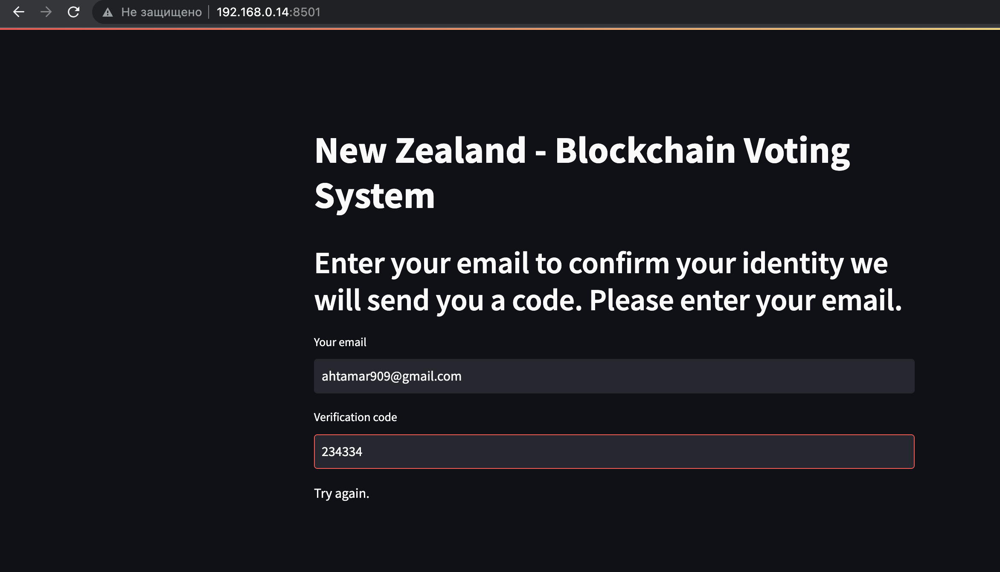
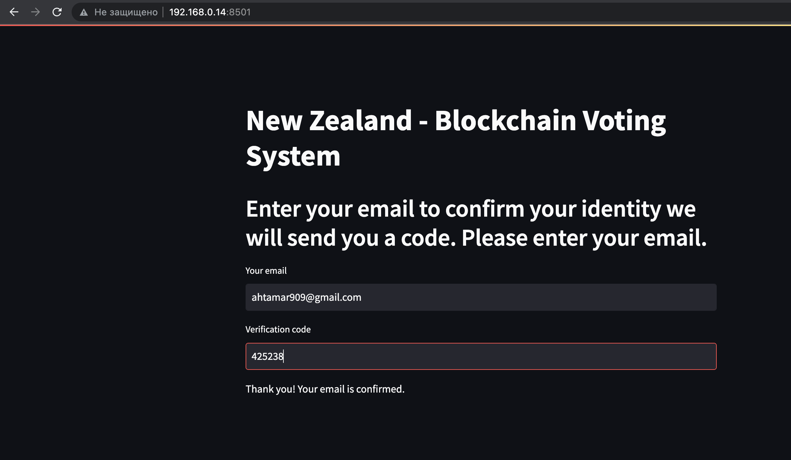

Preparation
----
env file must include\
{"TG_TOKEN":"...QUJ4",\
"GM_PASS":"lg...v",\
"GM_LOGIN":"abc@..mail.com"}

Run following
----
python3 -m pip install -r requirements.txt \
python3 main.py
----

And now go to http://t.me/monuvirtfin_bot

Or you can check the functionality from jupyter 
----

Or you can check the functionality with streamlit
----
 streamlit run streamlit.py
 
---

---

